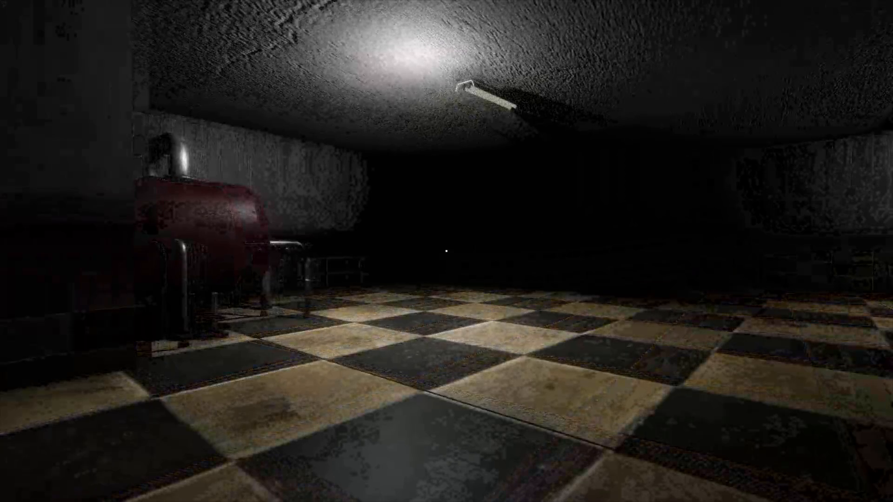
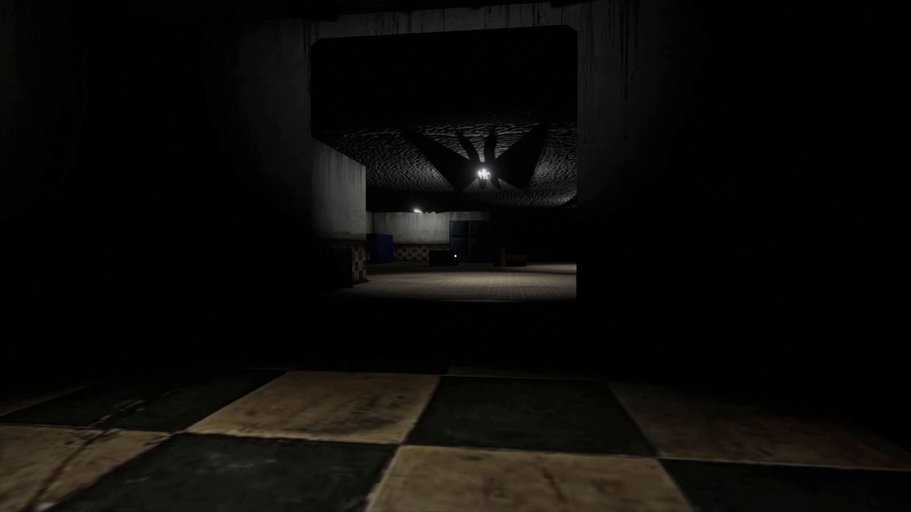
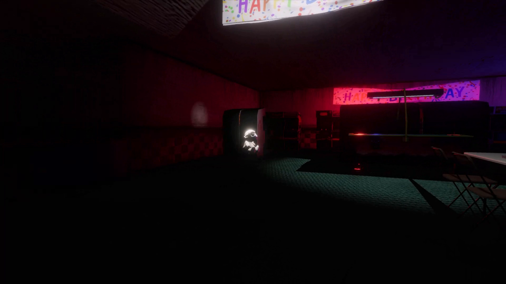

# Echoed Nights

A **first-person psychological horror game** built in Unity with C#, featuring reactive enemy AI, dynamic environmental storytelling, and a looping nightmare atmosphere. Built as my graduate capstone at Saint Martin's University and published on Steam.

**[▶ Echoed Nights on Steam](https://store.steampowered.com/app/4340810/Echoed_Nights/)**

> ### 📄 This repository is the project record, not the source code
>
> The Unity project is not published here. What this repo holds is the written and visual record of the project:
>
> | File | What it is |
> |---|---|
> | [`MSCS-ProjectReport-Landon.pdf`](MSCS-ProjectReport-Landon.pdf) | The capstone report — design, AI architecture, methodology, QA, and results |
> | [`Echoed Nights.pptx`](Echoed%20Nights.pptx) | The capstone defense presentation |
> | [`screenshots/`](screenshots) | Gameplay captures from the shipped build |
>
> If you came here for code, this isn't that repo — read the report instead. The evidence for this project is a game that shipped and a document that explains how it was built.

> ⚠️ **Development note:** Several features and mechanics changed significantly between the documented design and release.
>
> Notable example: enemy AI was originally architected using **reinforcement learning** — training agents through environmental simulations. This approach was scoped down due to the computational resources required to run sufficient training simulations. The shipped game uses **NavMesh pathfinding driven by coroutines and distance thresholds** — simpler even than the state-machine design the report describes, which survives in `Monster.cs` only as commented-out code. The report is preserved as a record of the full development process, including early design decisions and architectural exploration.

## Screenshots

| | | |
|---|---|---|
|  |  |  |

> **Role:** Lead Developer & Director  
> **Team:** Solo / small team  
> **Duration:** 2023 - 2024

## Overview
Echoed Nights puts the player in a dark, shifting environment where they must navigate terror while being hunted by intelligent AI enemies. The project demonstrates end-to-end game development — from initial design documentation through final quality assurance.

## Key Features

- **Enemy AI System** — NavMesh pathfinding with coroutine-driven Wander/Chase/Flee behaviour on distance thresholds (see AI Architecture below — the state-machine design in the report was cut before release)
- **Environmental Storytelling** — atmospheric sound design, lighting, and environmental cues drive the horror experience without heavy exposition
- **Full Project Lifecycle** — bi-weekly stakeholder reviews, milestone tracking, and structured QA process from design through delivery

## Tech Stack

| | |
|---|---|
| Engine | Unity 2022.3 |
| Language | C# |
| AI | NavMesh Pathfinding, coroutine-driven behaviour (the state-machine design is in the report, not the build) |
| Physics | Unity Rigidbody, Collider system |
| Audio | Unity Audio Mixer |
| Version Control | Git / GitHub |

## AI Architecture — the design, and what actually shipped

The capstone report describes a **state-machine design** with patrol, alert and search behaviours: Patrol
(waypoint following), Alert (investigate sound or peripheral movement), Chase
(pursue on confirmed line of sight), and Search (sweep the last known position).
That is the design.

**That is not what shipped.** The waypoint-patrol FSM exists in `Monster.cs`
but is commented out — it was cut to hit the release deadline. The shipped
enemy is simpler and coroutine-driven:

| Shipped behaviour | How |
|---|---|
| Wander | A coroutine sends the agent to random reachable NavMesh points with randomised idle/walk timing |
| Chase | Crossing `chaseDistance` flips a bool, exits Wander, and starts a Chase coroutine that sets the NavMesh destination to the player |
| Flee | Inside `fleeDistance` the same coroutine reverses, computing a vector away from the player |

Two coroutines and two distance thresholds — no state enum, and no memory:
once the agent starts chasing it never returns to wandering. The flee branch is
the part worth defending — a monster that always closes distance is trivially
learnable, and one that backs off when you crowd it keeps the encounter
unsettled.

NavMesh handles real-time pathfinding and obstacle avoidance underneath all of
it, so agents navigate complex geometry without clipping or getting stuck.

## Academic Context

Developed as a graduate capstone project at **Saint Martin's University** (M.S. Computer Science, completed May 2024). The [project report](MSCS-ProjectReport-Landon.pdf) in this repository is the full written research report on AI agent design in game environments.

---

**Developer:** Landon Armstrong | [GitHub](https://github.com/Larmstrong1127) | [LinkedIn](https://linkedin.com/in/landon-armstrong)
